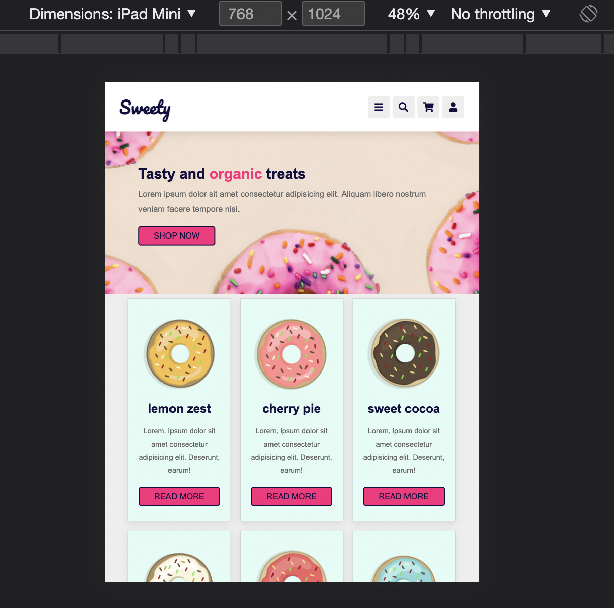
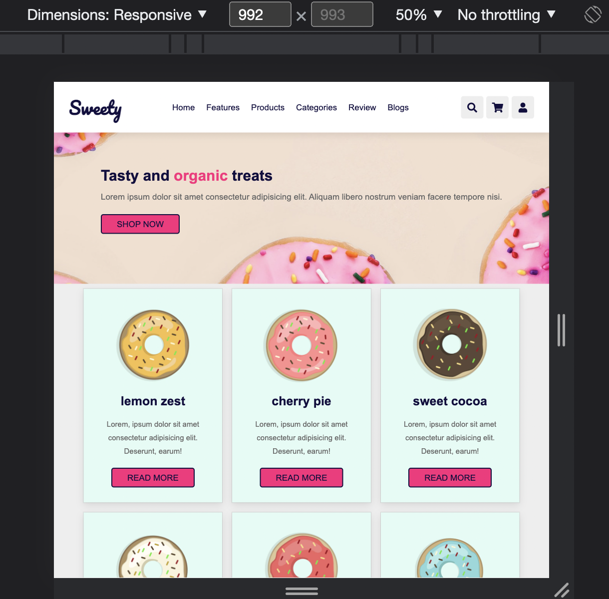

# UIB-sweety-layout

- Take a look at the screenshots in the design folder
- Create a responsive page based on the screenshots using flex and media queries

## Instructions

- Use CSS custom properties
- Use semantic tags (`header`, `main`, `nav`, `footer` etc.)
- Navigation should stay put while scrolling.
- Navigation links should be hidden on mobile.
- Make sure you show the burger icon on mobile ( no functionality ).
- Menu links should have a deep pink underline on hover
- Icons should have a deep pink background on hover

## Note:

- The text 'Sweety' is font 'Pacifico' from Google Fonts
- Other texts are 'Arial'

## Demo

https://user-images.githubusercontent.com/82094277/199498935-489679f7-409b-4380-9a46-14942342b30d.mov

## Tablet

## Desktop

## Extra

