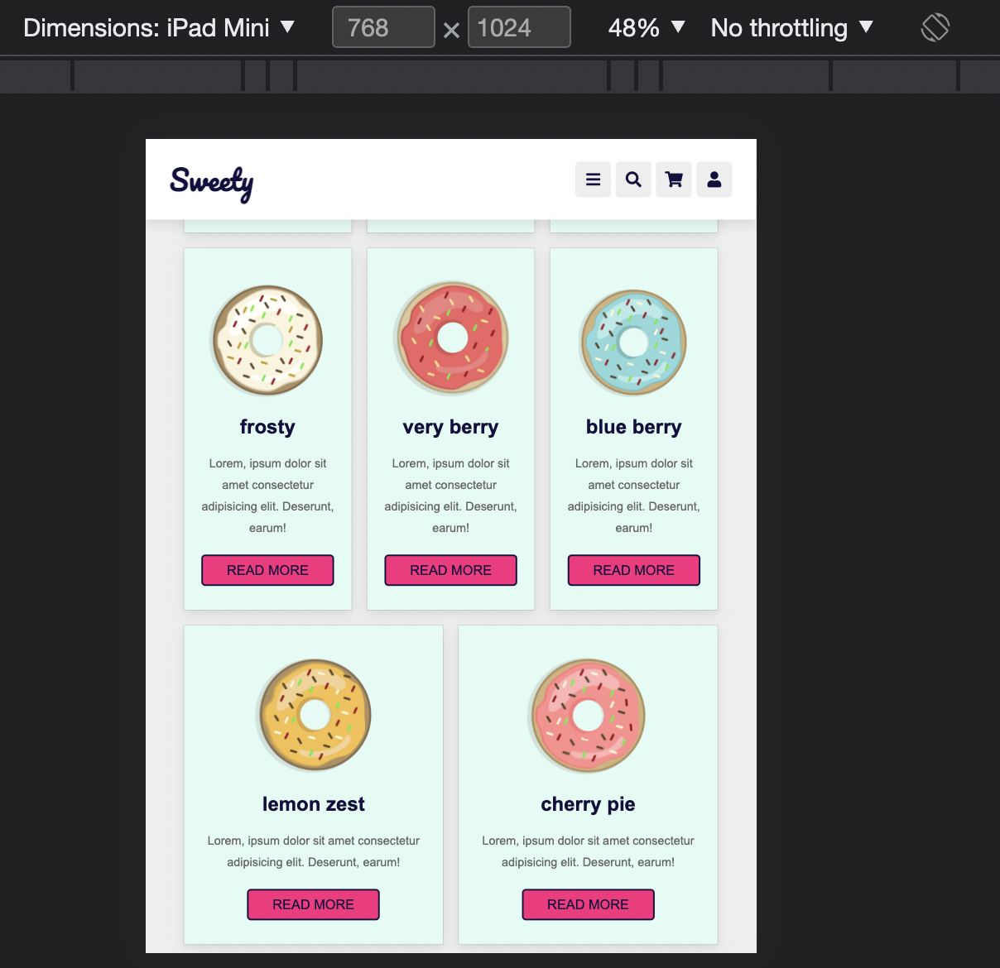
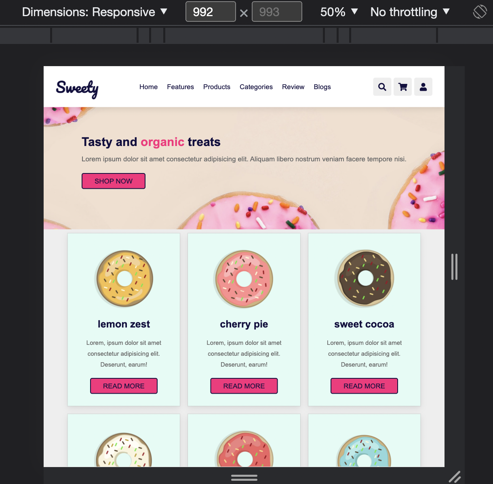
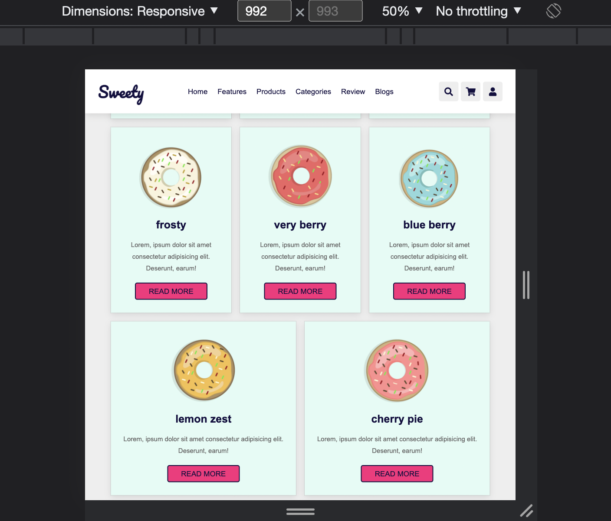

# UIB-sweety-layout

- Sieh Dir die Screenshots im Designordner an
- Erstelle eine responsive Seite auf Basis der Screenshots mit Flex und Media Queries

## Anweisungen

- Verwende benutzerdefinierte Eigenschaften
- Verwende semantische Tags (`header`, `main`, `nav`, `footer` usw.)
- Die Navigation sollte beim Scrollen an Ort und Stelle bleiben.
- Die Navigationslinks sollten auf mobilen Geräten ausgeblendet werden.
- Achte darauf, dass Du das Burger-Symbol auf dem Handy anzeigst (keine Funktionalität).
- Die Menülinks sollten beim Hovern tiefrosa unterstrichen sein.
- Icons sollten beim Hovern einen dunkelrosa Hintergrund haben.

## Notiz:

- Der Text "Sweety“ ist die Schriftart "Pacifico“ von Google Fonts
- Andere Texte sind 'Arial'

## Demo

https://user-images.githubusercontent.com/82094277/199498935-489679f7-409b-4380-9a46-14942342b30d.mov

## Tablet

## Schreibtisch

## Extra

